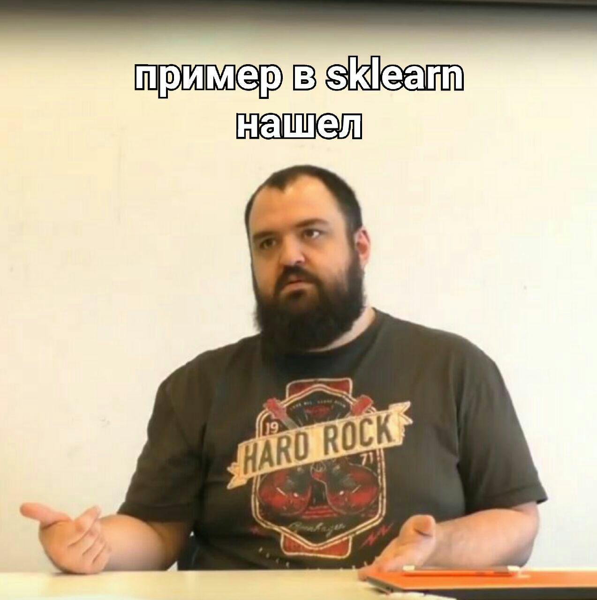
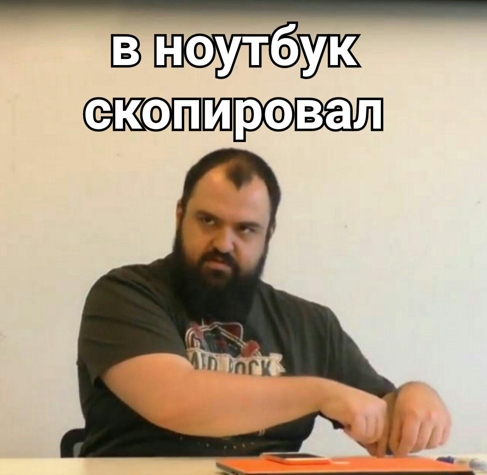
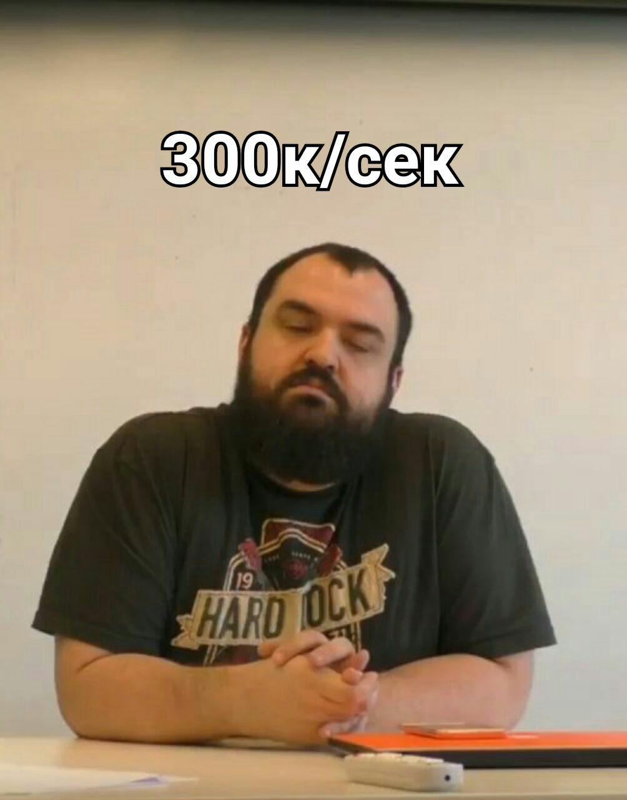
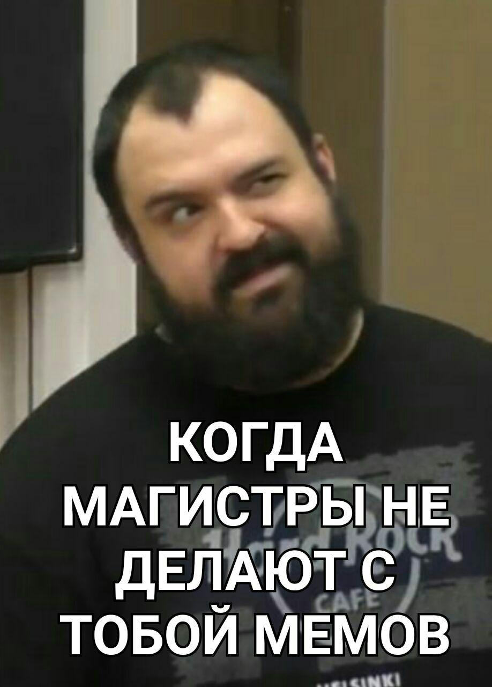
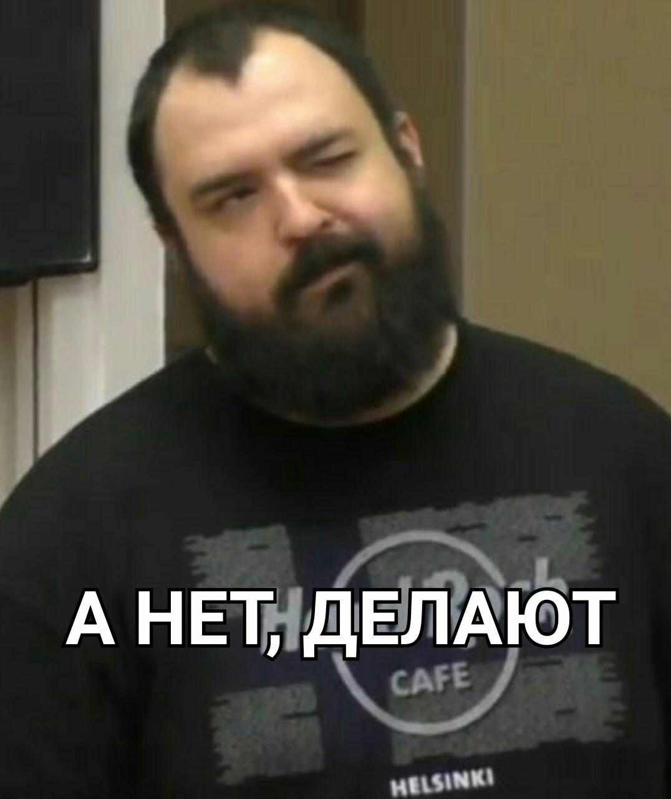
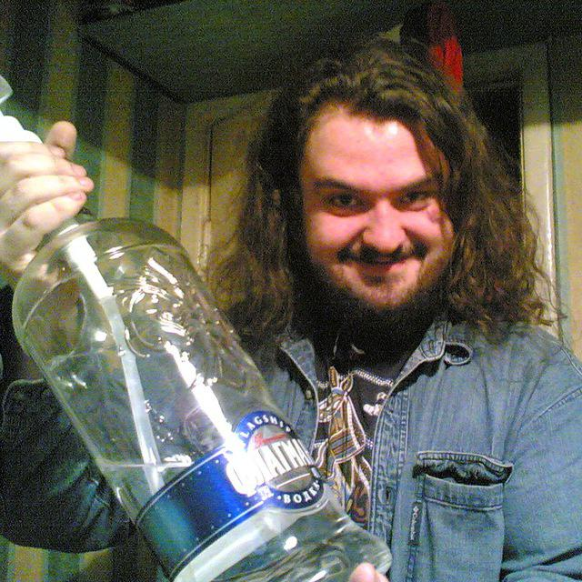

### Machine Learning

##### Структура курса

Каждую неделю читают лекцию, по ней чуть позже даётся домашнее задание. Обычно, нужно реализовать какую-нибудь модель, обучить на данных, посмотреть как работает, привести графики.

Выделенной практики нет, вся работа дома. Можно звонить в скайп, писать на почту, задавать вопросы. Если домашку делать в jupyter notebook'ах, то преподаватель сам смотрит и ставит оценку, иначе нужно её защищать (лично / по скайпу).

В начале каждой лекции quiz — тест с четырьям вопросами. Нужно либо выбрать ответ из приведённых, написать формулу, привести объяснение. Всё на понимание. На quiz минут пять, потом идёт разбор.

##### Содержание:

Конспект лекций: [здесь](notes.pdf). Все презентации одной [PDF-кой](slides/ML_all.pdf).

* [Метрические классификаторы, kNN, DROP5](slides/ML_2018_03_06_KNN.pdf)
* [Кластеризация, kMeans, Mean Shift, DBSCAN, Affinity Propagation ](slides/ML_2018_03_13_Clustering_Active_Learning.pdf)
* [Decision Trees, Precision/Recall, ROC-curve](slides/ML_2018_03_20_Trees.pdf)
* [Перцептрон, Размерность Вапника-Червоненкиса, Валидация](slides/ML_2018_03_27_Perceptron_VC.pdf)
* [Нейронные сети, Градиентный спуск, Back Propagation, Softmax](slides/ML_2018_04_03_Neural_Nets.pdf)
* [Deep Learning, Свёртка, Регуляризация](slides/ML_2018_04_10_Deep_Learning.pdf)
* [SVM, Kernel Trick](slides/ML_2018_04_17_SVM.pdf)
* [Байесовский классификатор, Expectation-Maximization](slides/ML_2018_04_24_Bayes.pdf)
* [Регрессия, Bias/Variance, Регуляризация, R² score](slides/ML_2018_05_08_Regression.pdf)
* [Глобальный и локальный поиск, Hill Climbing, No Free Lunch](slides/ML_2018_05_15_Global_and_Local_Search.pdf)
* [Анасамблевые методы; Theil-Sen Regressor, RANSAC, Huber Regressor; Voting, Bagging; Random Forests, AdaBoost, Gradient Boosting, XGBoost](slides/ML_2018_05_23_Ensembles.pdf)

##### Домашки

Все домашки лежат в ветке [`master`](https://github.com/xamgore/au-ml).

##### Видео

У меня есть видео лекций, могу скинуть при желании.

##### Рекомендация

Смотреть параллельно курс Воронцова. Есть ещё курс у бакалавров, у них тоже интересные презентации.

Можно посмотреть книги [Learning From Data](books/learning_from_data.pdf) и [Art of ML](books/art_of_ml.pdf).

##### Экзамен

На подготовку нужно примерно 4-5 дней и консультация, чтобы уточнить вопросы. Экзамен прошёл достаточно просто: пишешь два вопроса ([из списка](exam.html)), если не хватает баллов, то дают ещё два дополнительных вопроса.

* За quiz'ы можно получить 40 баллов максимум; [результат](quiz.png) моего года.

* За практику 120 баллов максимум, с этим все справились
* За экзамен 40 × 4 баллов.
* Соответственно `≥200` баллов — пять, `≥175` — четыре, `≥150` — три. У нас почти все [получили пятёрки](exam.png).

### Мемы

  

 

 

 

